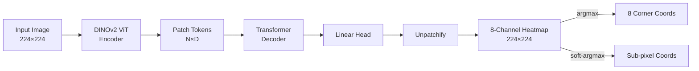

# IOPEN: Instance-level Object Pose Estimation Network

IOPEN estimates instance-level object pose by predicting the **2D projections of the 8 corners of a 3D bounding box** onto the image plane. The model adopts a **DINOv2 + Transformer Decoder** architecture, outputs keypoint locations as heatmaps, and achieves sub-pixel precision via differentiable **Soft-Argmax**.

> The architecture is inspired by [zju3dv/BoxDreamer](https://github.com/zju3dv/BoxDreamer).

---

## 1. Overview

### 1.1 Pipeline



1. **ViT Encoding**: A pre-trained DINOv2 model (ViT-Small or ViT-Base, with register tokens) extracts patch tokens as image features.
2. **Transformer Decoding**: Learnable query embeddings are fed into a Transformer decoder that cross-attends to the ViT patch tokens; each query corresponds to one image patch.
3. **Unpatchify**: Each patch's $8 \times p^2$ output is rearranged into an 8-channel heatmap ($H \times W$), where each channel represents a Gaussian heatmap for one 3D bounding-box corner.
4. **Coordinate Extraction**: At inference, argmax yields integer coordinates. During training, **Soft-Argmax** performs a differentiable weighted sum over the heatmap logits to produce normalized sub-pixel coordinates.

### 1.2 Loss Function

Training uses a **coarse-to-fine** two-stage loss:

| Stage   | Loss                      | Formula                                                                                                | Description                                                    |
|---------|---------------------------|--------------------------------------------------------------------------------------------------------|----------------------------------------------------------------|
| **Coarse** | Foreground-Weighted BCE   | $\mathcal{L}_{\text{coarse}} = \text{mean}\big((1 + \alpha \cdot H_{gt}) \odot \text{BCE}(H_{pred}, H_{gt})\big)$ | Up-weights Gaussian peak regions to focus the model on keypoint centers |
| **Fine**   | Smooth L1                 | $\mathcal{L}_{\text{fine}} = \text{SmoothL1}(\text{SoftArgmax}(H_{pred}), \text{coords}_{gt})$         | Regresses the soft-argmax normalized coordinates against ground truth |

An **adaptive weighting** mechanism automatically balances the scale of the two losses. The first few epochs (default 5) optimize only the coarse loss as a warmup.

### 1.3 Data Augmentation

- **Motion Blur**: Simulates motion blur, probability 0.9, kernel size 3–9
- **Crop Augmentation**: Random scaling (0.9×–1.2×) and shifting (±10%) of the object crop region
- **Normalization**: ImageNet statistics (mean=[0.485,0.456,0.406], std=[0.229,0.224,0.225])

---

## 2. Environment Setup

### 2.1 Install Dependencies

```bash
# Using conda (recommended)
conda env create -f environment.yml
conda activate iopen

# Or using pip
pip install -r requirements.txt
```

Key dependencies: PyTorch >= 2.0, torchvision, opencv-python, imageio, pyyaml, matplotlib, tqdm.

### 2.2 Download DINOv2 Pre-trained Weights

Download the corresponding backbone weights from [facebookresearch/dinov2](https://github.com/facebookresearch/dinov2) into `models/DINOv2/`:

| Model      | File                                  | Config                |
|------------|---------------------------------------|-----------------------|
| ViT-Small  | `dinov2_vits14_reg4_pretrain.pth`     | `model_scale: "small"` |
| ViT-Base   | `dinov2_vitb14_reg4_pretrain.pth`     | `model_scale: "base"`  |

---

## 3. Data Preparation

### 3.1 Training Data (PBR Synthetic)

Training data should follow the BOP format with the following directory structure:

```
<dataset_path>/
├── camera.json              # Camera intrinsics
├── models/
│   └── models_info.json     # 3D model dimensions (size_x, size_y, size_z)
└── train_pbr/
    └── 000000/
        ├── rgb/             # Rendered RGB images (000000.jpg, ...)
        ├── mask_visib/      # Visibility masks
        ├── scene_gt.json    # Per-frame pose annotations (cam_R_m2c, cam_t_m2c, obj_id)
        └── scene_gt_info.json
```

Configure in `config.yaml`:

```yaml
train:
  dataset_path: "/path/to/your/dataset/"
```

### 3.2 Evaluation Data (COCO Format)

Evaluation uses COCO-style annotation files containing `images`, `annotations` (with `bbox` and `keypoints`), and the corresponding raw frame images.

```yaml
eval:
  coco_path: "data/eval/instances_default.json"
  coco_frame_dir: "/path/to/eval/frames/"
  output_dir: "data/eval/result"
```

---

## 4. Usage

### 4.1 Configuration

Copy `config_template.yaml` to `config.yaml` and modify the paths:

```bash
cp config_template.yaml config.yaml
```

Key configuration parameters:

| Parameter                    | Description                                                              | Default    |
|------------------------------|--------------------------------------------------------------------------|------------|
| `model_scale`                | Model size: `"small"` (384-dim, 4 decoder layers) or `"base"` (768-dim, 12 layers) | `"small"` |
| `height` / `width`           | Model input size                                                         | 224        |
| `patch`                      | ViT patch size (must match DINOv2)                                       | 14         |
| `encoder_path`               | Path to DINOv2 pre-trained weights                                       | —          |
| `train.epoch`                | Number of training epochs                                                | 100        |
| `train.batch_size`           | Training batch size                                                      | 32         |
| `train.loss_temperature`     | Soft-Argmax temperature (smaller = sharper)                              | 0.1        |
| `train.loss_alpha`           | Foreground weighting coefficient                                         | 10.0       |
| `train.coarse_only_epochs`   | Warmup epochs with coarse loss only                                      | 5          |

### 4.2 Training

```bash
# Standard training (PBR synthetic data)
python train.py

# Run in background
nohup python -u train.py > train.log 2>&1 &
```

Model checkpoints are automatically saved to the `train.result_path` directory; the best checkpoint is saved at `train.best_checkpoint_path`.

To resume training from a checkpoint:

```yaml
train:
  use_checkpoint: True
  checkpoint_path: "models/IOPEN/best_bkp.pth"
```

### 4.3 Inference & Evaluation

```bash
# Run evaluation (inference on frame images and draw 3D bounding boxes)
python eval.py

# Compose result frames into a video
python scripts/make_eval_video.py \
    --input-dir data/eval/result \
    --output-path data/eval/video/output.mp4
```

**Keyframe Propagation** mode is supported: the model runs inference every N frames and intermediate frames reuse predictions from the nearest keyframe (matched via IoU-based tracking). Enable it in the config:

```yaml
eval:
  keyframe_propagation:
    enabled: True
    interval: 2
    match_iou_thr: 0.1
    match_center_thr: 2.0
```

### 4.4 Visualization Tools

```bash
# Visualize training samples (data augmentation & heatmap inspection)
python scripts/visualize_train_samples.py

# Visualize COCO annotation data
python scripts/visualize_coco_input.py
```

---

## 5. Project Structure

```
IOPEN/
├── config.yaml              # Main configuration file
├── config_template.yaml     # Configuration template
├── train.py                 # Training entry point
├── eval.py                  # Evaluation entry point
├── eval.sh                  # Evaluation + video generation script
├── environment.yml          # Conda environment
├── requirements.txt         # Pip dependencies
├── data/
│   └── eval/                # Evaluation data & results
├── models/
│   ├── DINOv2/              # DINOv2 pre-trained weights
│   └── IOPEN/               # Trained model checkpoints
├── scripts/
│   ├── make_eval_video.py           # Compose evaluation results into video
│   ├── visualize_coco_input.py      # Visualize COCO annotations
│   └── visualize_train_samples.py   # Visualize training samples
└── src/
    ├── config/              # Configuration loader
    ├── datasets/            # Training dataset & data augmentation
    ├── eval/                # Evaluator
    ├── models/              # IOPEN model + DINOv2 encoder
    └── train/               # Trainer & loss functions
```

---

## 6. References

- [zju3dv/BoxDreamer](https://github.com/zju3dv/BoxDreamer) — Architecture inspiration
- [facebookresearch/dinov2](https://github.com/facebookresearch/dinov2) — ViT backbone